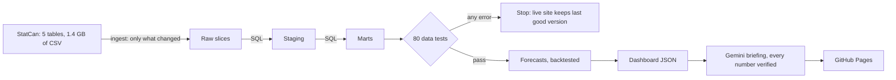

# Canada Economy Intelligence Platform

**Live dashboard: https://lekanlawal1.github.io/project5-canada-economy-platform/**

A self-refreshing data platform on Statistics Canada open data. Every weekday it checks
whether StatCan published anything new; when it did, it downloads the tables, rebuilds a
tested SQL warehouse, re-runs backtested forecasts, has an AI draft a monthly briefing whose
every number is checked by code, and redeploys the dashboard. No server, no cost, no manual
steps.



## What it shows

Five pages: **Overview** (headline numbers, forecasts, GDP, unusual moves, AI briefing),
**Labour**, **Prices**, **Housing** and **Province compare**. Every chart has a table view,
dark mode, and works on phones and tablets (tested at iPhone SE to iPad Pro sizes).

### Your inflation rate

The official inflation rate averages everyone's spending. The calculator on the Overview page works out yours:
enter roughly what you spend in a month (rent or other home costs, gas or transit, food...) and it weights each
category's 12-month price change by your spending, for Canada or your province. It also says why your rate
differs ("gas, up 25%, is 12% of your spending versus 4% for a typical household") and what that means in
dollars. Nothing typed leaves the browser.

- **Sourced, not guessed:** the "typical household" is StatCan's own CPI basket weights (table 18-10-0007),
  added to the pipeline as a sixth source.
- **Checked against the official answer:** with the official weights, the calculator must reproduce the
  published all-items rate. Measured over 220 province-months: 0.08 points off on average, 0.27 at most. A
  data test fails the deploy if any geography is more than 0.35 points off.
- **Two derived categories:** rent and gas are where people differ most, so they are split out. "Other home
  costs" and "other transportation" are worked out from the published groups minus those parts, by their
  official weights (`sql/marts/08_mart_personal_inflation.sql`).

## Results worth knowing

- **Matches StatCan's official releases exactly.** 11 headline figures (CPI 3.0%, gasoline
  22.8%, unemployment 6.4%, and more) are compared with StatCan's published numbers on every
  build. All 11 match.
- **Most monthly job moves are noise.** Each change is tested against StatCan's own margin
  of error. August 2026's employment drop of 41,700 sounds like news; it is not significant,
  and the chart shows it grey.
- **Simple forecasts are hard to beat, and the dashboard says so.** Backtested on 199 monthly
  origins (2010 to 2026) under rules committed before any result: a seasonal model beats the
  no-change forecast for next month's inflation (19% less error, p < 0.001). For unemployment,
  no model beats "next month equals this month", so that is what the site publishes.
- **The AI briefing cannot publish a wrong number.** Code checks every number in the draft for
  the right value, the right measure and the right direction. It caught 15 of 15 planted
  errors with 0 false alarms on correct drafts. A failed draft gets one retry, then a verified
  template is published instead. In 30 live Gemini runs, the first batch published an AI draft
  only 5 times in 10; reading every failure led to fixes on both sides (mostly verifier false
  alarms), and the next 20 runs all published a verified AI draft.

## Engineering highlights

| Area | What and why |
|---|---|
| Ingest | Conditional downloads (`304 Not Modified`), atomic writes, and the 1.18 GB labour file streamed through DuckDB, never loaded into memory whole |
| SQL models | Raw, staging, marts as versioned `.sql` files; prior months joined by calendar date because suppressed cells leave gaps that would break `LAG()` |
| Anomalies | Robust z-scores (median and MAD): a classic z-score called the September 2020 unemployment drop normal because COVID inflated the variance |
| Data tests | 80 checks: keys, nulls, business rules, freshness with a warning band, row counts against the last good run, and StatCan's official figures. Each failure mode was proven by injecting it |
| Forecasts | Rolling-origin backtest, Diebold-Mariano significance test, ranges from real past errors |
| AI | Gemini drafts, code verifies, template fallback, model output escaped as untrusted input |
| Automation | Daily cheap check, full rebuild only on new data, refreshed manifest committed back so the next check compares against what was published |

Every decision, with its reason and its limits, is written up in `docs/`.

## Run it locally

```bash
pip install -r requirements.txt
python -m src.ingest          # download (about 85 MB of zips)
python -m src.build           # raw, staging, marts, decision log (about 10 s)
python -m src.forecast        # backtest and forecasts (about 2 min)
python -m src.data_tests      # 80 checks against the real data
python -m src.site_export     # dashboard data
python -m src.briefing        # needs GEMINI_API_KEY for the AI path; template otherwise
cd site && python -m http.server   # open http://localhost:8000
python -m pytest              # unit tests, offline
```

## Documentation

| Doc | Covers |
|---|---|
| [01_ingest.md](docs/01_ingest.md) | Downloads, slicing, traps found while profiling |
| [02_models.md](docs/02_models.md) | SQL layers, significance, anomalies, check against official figures |
| [decision_log.md](docs/decision_log.md) | Every cleaning decision with rows affected, regenerated each build |
| [03_data_tests.md](docs/03_data_tests.md) | The 80 checks and proof each can fail |
| [04_forecast_protocol.md](docs/04_forecast_protocol.md) | Evaluation rules, committed before results |
| [04_forecasts.md](docs/04_forecasts.md) | Results in plain words |
| [05_dashboard.md](docs/05_dashboard.md) | Design decisions and browser testing |
| [06_briefing.md](docs/06_briefing.md) | The number verifier and its evaluation |
| [07_automation.md](docs/07_automation.md) | Schedule, refresh logic and failure handling |

## Honest limits

- Forecasts use each series' own history only; no outside drivers.
- The verifier checks numbers, not reasoning, and has two documented gaps.
- StatCan revises history; the platform always uses the latest vintage and does not track revisions.
- Data: Statistics Canada, under the Open Government Licence: Canada.
