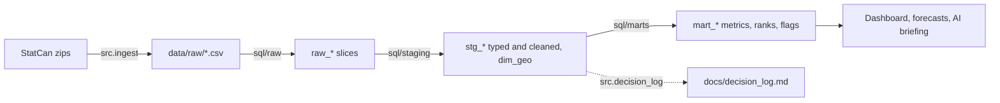

# Phase 2: SQL models

```bash
python -m src.build    # raw, staging, marts and the decision log, about 10 seconds
```



## Layers

| Layer | Job | Tables |
|---|---|---|
| raw | Keep only the slices we use, original values untouched | `raw_lfs`, `raw_cpi`, `raw_nhpi`, `raw_job_vacancies`, `raw_gdp` |
| staging | Types (`YYYY-MM` to `DATE`), pivots, drop empty rows, keep quality flags | `dim_geo`, `stg_lfs`, `stg_cpi`, `stg_nhpi`, `stg_job_vacancies`, `stg_gdp` |
| marts | Business metrics: changes, 3-month averages, province ranks, significance, anomalies | `mart_labour_monthly`, `mart_cpi_monthly`, `mart_housing_monthly`, `mart_job_market_monthly`, `mart_gdp_monthly`, `mart_province_scorecard`, `mart_anomalies` |

Every build rebuilds everything from scratch. An incremental build would need to track
StatCan's revisions to past months to stay correct; a full rebuild takes 10 seconds and is
always correct.

Every cleaning decision, why it was made and how many rows it touched is in
[decision_log.md](decision_log.md), regenerated on each build so the counts never go stale.

## Decisions and why

**Prior months are joined by calendar date, not with `LAG()`.** StatCan suppresses some
small-group cells (2,630 LFS rows), which leaves gaps inside a series. `LAG(x, 12)` would
then quietly compare against the wrong month. A test builds a series with a missing month
and checks the change comes out NULL instead of wrong.

**A labour move is called significant only if it beats StatCan's own error bar.** The
unemployment rate change must exceed 1.96 x StatCan's published standard error of that
change (95% confidence). The published error is used rather than derived because LFS keeps
5/6 of its sample from one month to the next, so consecutive months are correlated and
the naive formula would overstate the noise. In August 2026 the national employment level
fell by 41,700, which sounds like news but is within the error bar: the mart marks it not
significant.

**Anomalies use a robust z-score.** Score = (change minus the median of the prior 36
months) divided by 1.4826 x the median absolute deviation. Flag at |z| >= 3.5 (the
Iglewicz and Hoaglin cutoff), only with at least 24 months of history, and the window
excludes the current month so a spike cannot dilute its own score. Measured reason: the
COVID spike inflated the ordinary standard deviation for three years, so a classic z-score
scored the September 2020 unemployment drop of 1.0 points as -1.0 (normal). The robust
score is -6.7.

**CPI anomalies are scored on the change in yearly inflation, not the monthly change.**
CPI is not seasonally adjusted, so monthly moves include normal seasonal swings that
would be flagged every summer. The year-over-year rate cancels seasonality.

**Job vacancies are joined to unadjusted unemployment.** Vacancies are not seasonally
adjusted; dividing by an adjusted series would build a seasonal pattern into the ratio.
The unemployed-per-vacancy ratio is only computed when StatCan grades the vacancy estimate
A to D. Example: PEI's July 2026 estimate is graded F, so its ratio is blank rather than a
number nobody should trust.

**Every scorecard figure carries its own month.** LFS, CPI and housing run to August
2026; vacancies and GDP to July. One shared "as of" date would mislabel some numbers.

**Rounded to published precision.** Changes are rounded to the decimals StatCan publishes,
so floating point noise (0.1 minus 0.3 is -0.19999999999999998) never reaches a chart or
the AI briefing, which matters when phase 6 checks every number in the text.

## Checked against the official release

StatCan's Labour Force Survey release for August 2026 (The Daily, 4 September 2026)
reports Canada 6.4% unchanged, Newfoundland and Labrador 8.6% (down 0.7), Prince Edward
Island 7.9% (up 1.1) and employment of 21,173,000. `mart_labour_monthly` gives exactly the
same four figures. CPI has not yet been checked against an official release; phase 3 adds
that as a data test.

## Honest limits

- **Significance is coarse.** StatCan rounds its standard errors to 0.1, so for Canada the
  threshold is 1.96 x 0.1 = 0.196 and any 0.2 point move counts as significant.
- **Anomaly volume.** 2,756 flags across all history, a rate of 1.4% (labour) to 2.9%
  (GDP) of scored observations, about 3 per month in recent CPI data. Economic data have
  heavier tails than a normal distribution, so this is more than the textbook rate. The
  briefing ranks by |z| and reports the latest month only.
- **Predictable policy changes are flagged.** Manitoba energy inflation jumped 19.6 points
  in April 2026, most likely the base effect of the consumer carbon tax removal in April
  2025 dropping out of the yearly comparison. Real and worth knowing, but not a surprise.
  Annual excise changes on alcohol and tobacco show up the same way.
- **Revisions are not tracked.** Each build uses StatCan's current history, so a past
  month's value can change between builds without a record.
