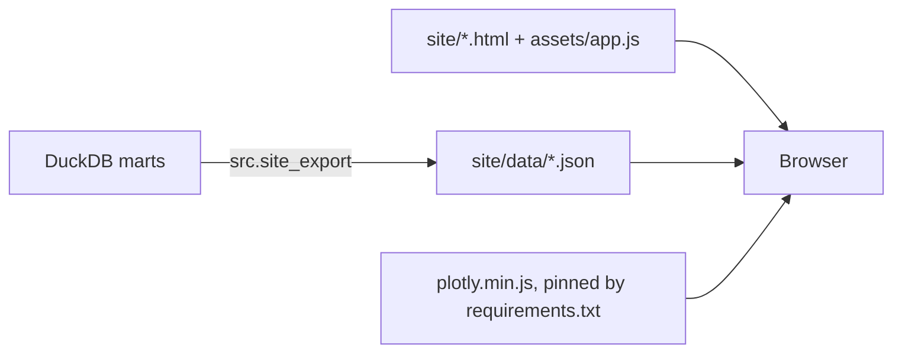

# Phase 5: Dashboard

Five static pages on GitHub Pages: **Overview, Labour, Prices, Housing, Province compare**.

```bash
python -m src.site_export          # writes site/data/*.json, copies the Plotly bundle
cd site && python -m http.server   # then open http://localhost:8000
```

## Architecture



No server and no database at runtime. The deploy workflow rebuilds everything and uploads
`site/` as a static artifact.

## Decisions and why

**Static site, not Streamlit or Dash.** A static site costs nothing, cannot go down at 3am,
loads fast, and needs no secrets. The data changes monthly, so a live server would spend
almost all its time serving numbers that have not changed. Project 2 already shows a
Streamlit app; this shows the other pattern.

**Every number is computed in SQL; the browser only draws.** The JavaScript does no
arithmetic on the data beyond sorting and slicing. So the dashboard cannot disagree with the
data tests, the decision log or the AI briefing: they all read the same marts.

**Columnar JSON.** `{"month": [...], "ur": [...]}` instead of one object per row: about a
third of the size, and the shape Plotly expects. All six files total about 730 KB (measured: the labour file is 34% the size of the same data as row objects).

**The chart library is vendored, not loaded from a CDN.** `plotly.min.js` is copied from the
Python package pinned in `requirements.txt` at build time. The version is fixed by the same
file as every other dependency, and the site works even if a CDN is down or blocked.

**Honesty is built into the charts, not left to footnotes.**
- *Monthly employment change:* bars within StatCan's margin of error are grey; only
  significant months are coloured. In August 2026 employment fell 41,700, which sounds like
  news, but the bar is grey.
- *Forecasts:* every forecast shows its 80% range from real past errors, and a plain-language
  verdict under each chart says which horizons a model actually won. For unemployment the
  answer is none.
- *Quality flags:* new home prices StatCan marks "use with caution" are drawn faded; job
  vacancy estimates graded E or F are left out of the ratio, and the scorecard shows the grade.
- *Reference months:* every tile and every scorecard column states its own month, because
  LFS, CPI and housing run a month ahead of vacancies and GDP.

**Chart rules followed (and checked).**
- No dual axes anywhere. Inflation and unemployment are separate charts.
- At most 3 coloured series per chart: the palette was run through a colour-vision-deficiency
  validator, and only its first 3 colours stay distinguishable in every pairing. Ten
  provinces are shown as small multiples (one panel each, Canada in grey), not as ten
  coloured lines.
- Colour follows the entity: Canada is always blue, the comparison always orange.
- Every chart has a "Show data table" twin, so no value is reachable only by hovering.
- Light and dark modes are designed separately; dark is not an automatic inversion.

## Tested in a real browser

Every page was rendered in headless Chromium at 1280 px (light) and 390 px (dark, phone) and
the screenshots reviewed. That caught real problems a code review would miss:

| Problem found | Fix |
|---|---|
| Forecast charts unreadable: 2018 history included the COVID spike, squashing the forecast | History starts 2022 |
| "Canada" reference label clipped at the top of ranking charts | Top margin |
| Year labels cut off under the bottom row of small multiples | Bottom margin |
| On phones the page was 449 px wide on a 390 px screen: a long dropdown option set its width | `select { max-width: 100% }` |
| On phones, "Newfoundland and Labrador" ran into the next panel's title | Province codes on narrow screens |
| GDP tile showed "-0.0%" (floating point negative zero) | Normalised in the export |

Building the export also exposed a data bug: the housing "use with caution" flag was NULL,
not false, on ordinary rows, because `NULL = 'E'` is NULL in SQL. The dashboard would have
treated "unknown" as "fine" by accident. Fixed in staging, and a not-null data test now
guards it.

## Honest limits

- **Not yet live.** The repository is private, and GitHub Pages for a private repository
  needs a paid plan (the published site would be public either way). The deploy workflow
  is ready and runs by manual trigger once Pages is switched on.
- **Hover is mouse-first.** Every value is also in a table view, but keyboard users get the
  table rather than the chart tooltips.
- **No automated visual tests.** Screenshots were reviewed by eye during development; CI checks
  that the export runs, not that the pages look right.
- **Plotly is a 4.7 MB file** (about 1.4 MB compressed). Acceptable for a portfolio dashboard;
  a custom Plotly bundle with only the chart types used would cut it by more than half.
