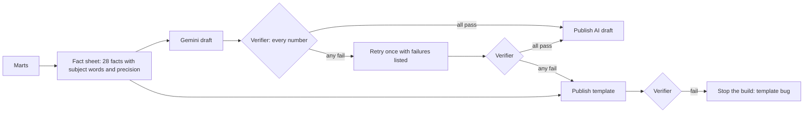

# Phase 6: AI briefing with a number verifier

```bash
python -m src.briefing     # writes site/data/briefing.json (after src.site_export)
```

**The AI drafts; code verifies.** Gemini (`gemini-3-flash-preview`) writes a short monthly
briefing from a fact sheet. Before anything is published, code checks every number in the
text. If a draft fails, the model gets one retry with the exact failures; if that fails too,
a template briefing built from the same facts is published instead. The page always says
which path was taken and how many values were verified.



## What "verified" means

A number passes only if some fact matches it on all three tests:

1. **Value**, at the fact's published precision. Rounding down in precision is allowed
   ("about 3" for 3.02); adding precision is not ("3.03%" for a 3.0% fact).
2. **Subject.** One of the fact's subject words must be in the same sentence. Province facts
   need the province AND the measure, so Newfoundland's 8.6% unemployment cannot be passed
   off as its inflation rate.
3. **Direction.** For a change, words such as "rose" or "fell" near the number, or an
   explicit plus or minus sign, must agree with the sign of the change.

Checking only that a number "exists somewhere in the data" would be much weaker: 3.0 is
both the inflation rate and a plausible unemployment rate.

## Evaluation (tests/test_number_verifier.py)

15 drafts with planted errors of the kinds language models actually make, and 9 correct
paraphrases. Every run of the test suite repeats this.

| Planted error | Caught |
|---|---|
| Wrong value (6.5% for 6.4%) | yes |
| Inflation's value used for unemployment | yes |
| Wrong direction ("rose 0.7" for a fall) | yes |
| Wrong explicit sign (+0.7 for -0.7) | yes |
| Invented statistic (wages) | yes |
| False precision (3.03% for 3.0%) | yes |
| Rounding up a value (2.2% for 2.1%) | yes |
| Scale error (417,000 for 41,700) | yes |
| Number glued to a unit ("417k") | yes |
| Right value, wrong province | yes |
| Right province, wrong measure | yes |
| Fall in home prices described as a rise | yes |
| GDP growth described as shrinking | yes |
| Zero change described as a rise | yes |
| Made-up ordinal ("3rd straight month") | yes |

**15 of 15 caught, 0 of 9 correct drafts flagged.** That is on cases I wrote, so it shows the
checks work as designed, not how often a real model errs. The real-model numbers come from
the live runs below.

Two cases in the evaluation caught bugs in the verifier itself during development: numbers
glued to letters ("417k", "3rd") were skipped entirely, a loophole now closed.

### Known gaps, tested as gaps

- **Two measures in one sentence.** "Inflation was 3.0% while unemployment was also 3.0%"
  passes: subject matching works per sentence, so the second 3.0 borrows "inflation".
  The prompt asks for clear sentences; a clause-level parser would close it.
- **Claims without numbers.** "Unemployment surged to a record high" passes: there is no
  number to check. Only numbers are verified, never wording.
- **Strictness has a cost.** "COVID-19" would be flagged (19 is not a fact). A false alarm
  only costs a fallback to the template, while a missed error publishes a wrong number, so
  the verifier is strict on purpose.

## Other decisions

- **The template is verified too, and a failure stops the build.** It is generated from the
  same facts, so it should always pass; if it ever does not, that is a bug to fix, not
  something to publish around.
- **One retry, with the failures spelled out.** Telling the model "6.1 in this sentence:
  no fact has this value" fixes most slips. More retries would mostly add cost and time.
- **Errors never break the deploy.** No key, network failure, quota or malformed response
  all fall back to the template. The dashboard is never blocked by the AI step.
- **The model's text is untrusted input.** It is HTML-escaped before it reaches the page, and
  em and en dashes are replaced (house style; punctuation cannot change a number).
- **"N values verified" counts data values only.** Years and context numbers ("12-month")
  are checked but not counted, so the claim on the page is not inflated.
- **thinkingLevel is "low".** In a previous project the default thinking level sometimes ran
  for minutes per request; this task is short and fully specified.
- **The key comes only from the environment** (a GitHub Actions secret in deployment). It is
  never written to a file in the repository.

## Live model runs

Three batches of 10 real runs each (`.github/workflows/briefing-eval.yml`, October 2026,
gemini-3-flash-preview, thinkingLevel low). Each run goes through the full flow: draft,
verify, one retry, template fallback. The fixes between batches came from reading every
failure; each later batch used fresh drafts, not the ones the fixes were based on.

| Batch | Verified first draft | Verified after retry | Fell back to template | Median response |
|---|---|---|---|---|
| 1: first version | 4 of 10 | 1 of 10 | **5 of 10** | 2.3 s |
| 2: after fixes below | 9 of 10 | 1 of 10 | 0 of 10 | 7.5 s |
| 3: after cut-off fix | 9 of 10 | 1 of 10 | 0 of 10 | 2.2 s |

Before batch 1 there was a run on the live deploy that failed twice on the same number. The
cause was ours: GDP's monthly change was rounded to -0.0 in the mart and shown to Gemini as
"-0.00", so it faithfully described a zero change as a fall, and the verifier rightly rejected
it. Fixed at the source, with a test.

### What batch 1 taught, and what changed

12 verifier failures in batch 1, read one by one:

- **9 were false alarms by the verifier.** "Real GDP showed a change of 0.00 and rose 1.4 from a
  year earlier": the direction check looked 30 characters past each number, so "rose" (which
  belongs to 1.4) was read as describing 0.00. Fix: each number's direction words now stop at
  the neighbouring number or a clause break (and, but, though, while, commas).
- **1 was a keyword gap.** Gemini wrote "food from stores"; the grocery fact only knew "grocer"
  and "food purchased". Added.
- **2 were genuine rule breaks by Gemini.** "The rate fell 0.7" never says which rate. These
  stay rejected: every sentence must name its measure.

The passing drafts were accurate but read badly ("the unemployment rate was 6.4", "fell by
-0.7"), because the fact sheet gave bare signed numbers and the model copied them. Facts now
carry units and are worded as a direction plus a size ("down 0.7 percentage points"), and the
prompt forbids minus signs and bare "the rate".

All 12 real sentences are now regression tests: the false alarms must pass, the rule breaks
must stay rejected, and the 15 planted errors must all still be caught. Loosening the verifier
to fix false alarms could not quietly let real errors through.

### What batch 2 taught

One draft stopped mid-number: "(41,70". Gemini's thinking tokens count against the output
limit, and 2,048 was too low for that run. The verifier happened to catch it (the broken number
matched no fact), but a cut-off draft should be rejected for what it is, not by luck. Now:
the response's `finishReason` is checked and anything other than a normal stop is rejected,
the limit is 4,096, and errors get the second attempt instead of going straight to the
template. Batch 3: every draft complete, 32 to 36 numbers each.

### A published draft (batch 3)

> The Canada unemployment rate was 6.4% in August 2026. The monthly change in the unemployment
> rate was unchanged, which is within the survey's margin of error. Compared to a year earlier,
> the unemployment rate fell 0.7 percentage points. [...] Canada CPI inflation was 3.0% in
> August 2026, which matches the 3.0% recorded in July 2026. Core inflation was 2.1%. [...]
> Real GDP was unchanged in July 2026. On a yearly basis, real GDP was up 1.4%.

Every number correct, but the style is flat and list-like. The strict rules (name the measure
in every sentence, copy values exactly) trade fluency for checkability. That is the right trade
for a public page; a looser style would need a smarter verifier first.

## Honest limits

- The verifier checks numbers, not reasoning. A draft can be numerically perfect and still
  emphasise the wrong thing.
- The fact sheet decides what the briefing can say. Anything not in it (wages, interest
  rates) cannot appear, by design.
- One model. 30 live runs is enough to see the failure modes, not to estimate a rare error
  rate: a 1 in 100 problem could easily not appear yet. The verifier, not the pass rate, is
  what protects the page.
