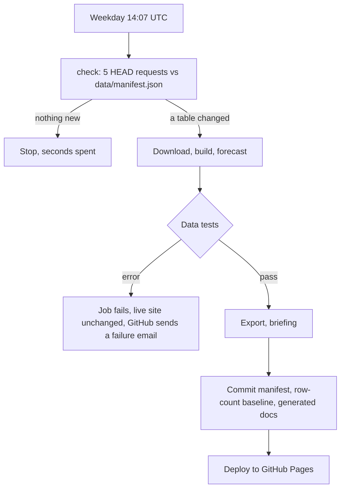

# Phase 7: Automation

Two workflows in `.github/workflows/`:

| Workflow | Runs on | Does |
|---|---|---|
| `ci.yml` | Every push and pull request | Unit tests (offline), then the full pipeline on real data with the data tests, export and template briefing. Proves a code change still works on live data. Deploys nothing |
| `deploy.yml` | Weekdays at 14:07 UTC, manual runs, and pushes that change the site or pipeline | Checks StatCan, rebuilds only if needed, deploys |

## The refresh loop

## Decisions and why

**Poll daily, rebuild only on new data.** StatCan releases at 8:30 a.m. Eastern, on different
days for each table (labour early in the month, CPI mid-month, GDP at the end). Hard-coding a
release calendar would break whenever StatCan shifts a date. Instead a check runs every
weekday: five `HEAD` requests compared with the committed manifest, a few seconds of work.
The full 4 minute pipeline only runs when something actually changed, roughly 5 times a month.

**14:07 UTC.** That is 10:07 Eastern in summer and 9:07 in winter, after the release either
way. Off the hour because GitHub delays scheduled jobs at :00 when load is high.

**The workflow commits the manifest back.** After a successful run, the new
`data/manifest.json`, `data/row_counts.json` and generated docs are committed by the bot.
Without this, tomorrow's check would compare against stale dates and rebuild every day.
Only a run with zero data test errors gets here, so a bad build never becomes the baseline.
Pushes made with the workflow's own token do not trigger other workflows, so this cannot loop.

**Failure keeps the last good site.** Data tests run before export and deploy. Any error ends
the job, nothing is committed, nothing is deployed. GitHub sends the failure notification to
whoever last changed the workflow's schedule (here, the repository owner).

**Exit codes carry meaning.** `src.ingest --check` exits 0 for "nothing new", 1 for "changed",
and 2 when StatCan cannot be reached. A network error used to crash with code 1, which the
scheduler would have read as "changed"; it now fails visibly instead. A unit test covers all
three codes.

**Least privilege.** Each job gets only the permissions it needs: `check` reads, `build` may
write repository contents (for the commit), `deploy` may write Pages. The Gemini key is a
repository secret, passed only to the briefing step.

## Cost

GitHub Actions minutes are free for public repositories. A quiet weekday costs about 20
seconds; a release day about 5 minutes.

## Honest limits

- **Polling, not push.** StatCan offers no webhook, so a release is picked up at the next
  14:07 UTC check, up to a day late on weekends.
- **GitHub pauses scheduled workflows in public repositories after 60 days without
  activity.** I have not confirmed whether the bot's data commits count as activity. If the
  schedule ever pauses, re-enable it from the Actions tab; a manual run always works.
- **One retry policy for everything.** A transient StatCan outage fails that day's run; the
  next weekday's run picks the data up.
